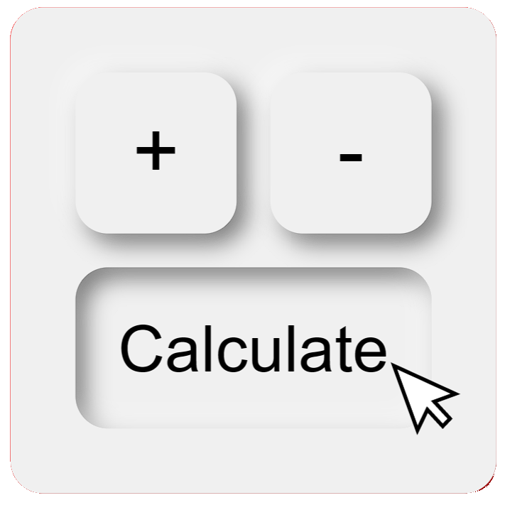

# [Calculator ](https://acalc.netlify.app)

)

## Introduction
The Web Calculator is a basic calculator web application created using JS, HTML, and SCSS. It provides users with a straightforward and intuitive interface for performing basic arithmetic operations.

## Features
- Addition, subtraction, multiplication, division and more operations.
- Responsive design for seamless use on various devices.
- Hover animation for an interactive visual experience.
- Supports both mouse and keyboard input.
- Button press animation when performing calculations using either mouse or keyboard.
- Clear and user-friendly interface

## Usage
- Open the [Calculator](https://acalc.netlify.app) in your web browser.
- Use the calculator interface to perform addition, subtraction, multiplication, division or more operations.
- Alternatively, you can use your keyboard for input in addition to the calculator buttons.

- Enjoy a simple and responsive calculator experience.
